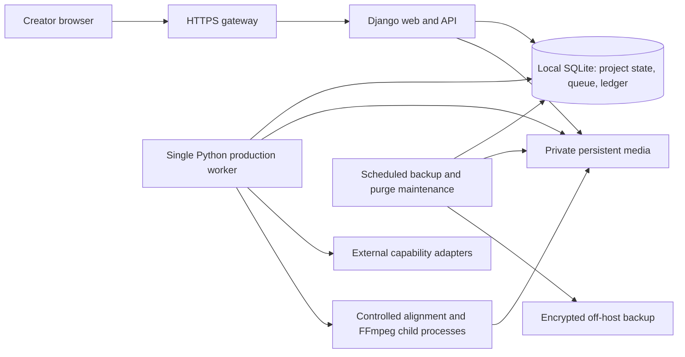

# Private Alpha architecture

## Owner amendment — feature entitlement and discovery boundaries, 2026-10-05

[Alpha product specification](ALPHA_PRODUCT_SPEC.md#owner-decision--research-entitlement-and-topic-discovery-2026-10-05)
owns the exact entitlement matrix. Research, Topic Suggestions and Custom Topic
Suggestions require 3 videos/week or 1 video/day; Expert Topic Suggestions
requires 1 video/day only. Entitlement is authoritative persisted server-side
account/subscription state, not a client plan name, route guard or hidden button.
Do not require a new billing service to represent this decision. Private-Alpha
entitlement assignment, persisted schema and future subscription integration
are unresolved; this is a contract, not implementation.

Check project/account ownership and feature entitlement **before** admitting
Research, random collection access, custom generation, or Expert retrieval/AI
work. Paid work then separately requires bounded USD authority, quota admission,
reservations and concrete attempt/retry accounting. Revalidate authority at
execution according to the accepted job contract; model output cannot admit
work, select a paid tier, widen retrieval or enlarge spending limits.

Three separate capabilities: stored/random Topic Suggestions (no per-click
LLM), category-driven Custom Topic Suggestions (owner-selected
**`gemini-3.8-flash`**), channel/niche-informed Expert Topic Suggestions
(model and retrieval unresolved). No silent Custom model substitution on
unavailability or unfavorable economics: require an explicit product/architecture
update. Discovery is optional before production and must not add mandatory
per-video model calls or a new frontend/service. Suggestion delivery/history
contracts and first-Alpha release assignment are not settled.

A YouTube URL alone does not establish Gemini channel-inspection capability.
Before Expert implementation, establish channel/name/URL resolution; the
specific official/permitted API/retrieval mechanism and permitted information;
retention; finite request/result/content/token/cost bounds; model selection;
rate quotas; failure and private/unavailable-channel handling. User links are
untrusted input, not arbitrary worker fetch instructions. The application must
admit retrieval within validated permitted endpoints and scope, never accept
model-selected unlimited external work. Niche-only context may avoid channel
retrieval. No scraping/API/schema or retention exception is selected here.

Research continues to use the existing application-bounded S4-R capability when
entitled and applicable. Lower-tier topics must not invoke it. Pasted-script
checking remains its separately specified workflow. Existing quality/provenance
requirements are unchanged; these suggestion decisions add no Alpha feasibility
gate or production implementation authorization.

Owner S9 revision 5, 2026-10-05: Alpha estimates expose credits **and USD** while
financial authority remains deterministic USD exposure/attempt/reservation/quota
accounting. Before script exists, use ~12 images per requested minute as a topic
estimate only. After generated script completion or immediately for pasted
scripts, predicted planned images equal deterministic sentence count. Preserve
script/research consumed work and recompute remaining scope, then revalidate
request-specific authorization and budget before asset submissions. No model
output enlarges authority. Credit-debit/material-scope threshold policies remain
open; no universal image-density cap is selected. See [S9 v5](architecture/evidence/operating-economics/S9/CREDITS-v5.md).
Sentence-based visual planning does not change B multi-scene TTS segments or
continuous narration; Scene Audio Mappings still govern visual/caption timing.

Current S5 decision, 2026-10-05: **PASS at the existing owner-defined B + B mapping gate**. Use coherent multi-scene initial generation and whole affected-segment corrections, preserving prior versions/unrelated segments. Narration stays continuous; next-scene-start mappings govern visuals. [Final evidence/limits](architecture/evidence/narration-feasibility/runs/approved-lite-v1/b-mapping-final-v1/README.md) supersedes older S5 pending notes. Segmentation tuning remains unfrozen; no unsafe range extraction or production implementation is authorized.

Status: accepted Private Alpha architecture baseline, confirmed by the user on 2026-10-03, subject to all documented evidence gates and feasibility spikes. Acceptance approves design only; no implementation, experiments, purchases or task-graph generation are authorized. Budget feasibility has not been demonstrated.

The [Alpha product specification](ALPHA_PRODUCT_SPEC.md) controls product scope. [Pipeline investigation](PIPELINE_INVESTIGATION.md) records actual legacy behavior. Detailed contracts have one authoritative home: [artifact/dependency model](ARTIFACT_MODEL.md), [job execution and failures](JOB_EXECUTION_MODEL.md), [cost/reservations](COST_MODEL.md), and [feasibility gates](ARCHITECTURE_SPIKES.md). The discovery notebook is historical rationale, not a competing runtime specification.

Narration amendment: **accepted by the user**, 2026-10-03. The accepted baseline is amended only for narration granularity; all evidence gates remain in force. See the [artifact model](ARTIFACT_MODEL.md#narration-generation-granularity--accepted-amendment) for the decision, alternatives and contracts. The owner's latest S5 decision supersedes B + C1: use B coherent generation for both initial narration and affected-segment corrections. S5 remains NOT_YET_PASS pending technically validated scene/audio mapping. See the [current decision record](architecture/evidence/narration-feasibility/runs/approved-lite-v1/b-only-review-v1/README.md).

## Runtime shape

One application codebase runs on one persistent host. Separate the short-lived web request process from one production worker. Provider, alignment and FFmpeg work execute through that worker; they do not run inside an HTTP request or framework request-background callback. Rendering is a worker capability, not a separately deployed service.

The gateway may be host software or a deployment facility; no vendor is selected. Static UI files may be public. Project media, database files, scratch and credentials never have public filesystem routes. Background maintenance has no generation authority and must coordinate storage/snapshots with the running app. It is not another production worker.

### Runtime and application boundary decision

[ADR-0002](adr/0002-python-web-and-controlled-worker.md) is authoritative for the Python/Django runtime choice, existing-pipeline A/B/C comparison, alternatives, tradeoffs and evidence gates. The browser UI remains an interaction requirement, not a separately deployed frontend service.

## Relational state

SQLite stores users/sessions, ownership, project and scene metadata, typed artifact content/versions, selections and provenance, jobs/operations/attempts, progress events, render locks/manifests, export registrations, research/warnings, financial ledgers/reservations and deletion state. Large media bytes do not live in the database.

### Database decision

[ADR-0003](adr/0003-single-host-sqlite-alpha.md) is authoritative for the conditional SQLite choice, alternatives, transaction/money constraints and evidence gates. PostgreSQL is the explicit reconsideration path if the gate fails or a demonstrated multi-host requirement arises.

## Project domain and ownership

One User owns each Project; there are no teams/workspaces in Alpha. Every scene, artifact/version, operation, warning, upload and export resolves to that project. There is no public project sharing. The [artifact model](ARTIFACT_MODEL.md) defines Original Input, current Script, stable Scenes, typed Artifacts/Versions, Research Results and Factual Warnings without collapsing them into an MP4.

Jobs are execution requests; Operations are scoped units of work; Attempts record concrete executions/provider submissions. Render is an execution over a fixed manifest; Final Export is its successfully validated persisted output. An Allowance belongs to an identity. Shared operating Budget belongs to the owner and period. Authorization is user/owner authority; Reservation is a held liability, not actual consumption. See the dedicated models for relationships.

## Media and storage

### Storage decision

**Decision:** Use private host-local persistent file storage initially, referenced by opaque logical keys in database metadata. Keep an explicit media boundary so later object storage is a migration, not a domain rewrite. Backups live encrypted in a separate location; no storage provider or quota selected.

**Requirements:** Images/audio/intermediates/exports/previous versions, safe FFmpeg access, retention, isolated delivery and low-cost single-host operation.

**Alternatives:** Object storage immediately; database BLOBs; public project directories; ephemeral deployment filesystem.

**Tradeoffs:** Local files simplify media processing but share the host's failure domain. Object storage adds transfer/authorization/egress complexity. Persistent media and the database must be backed up consistently. Database rows are authoritative references, not filename scans.

**Reversibility:** Moderate bulk migration; retain logical keys, byte hashes/sizes/types and original provenance rather than absolute paths in domain records.

**Evidence needed:** Per-project and peak scratch sizes, storage admission margins, backup/restore and hosting durability. Concrete caps are chosen only after measurement.

Storage classes:

| Content | Authoritative location and lifecycle |
| --- | --- |
| Original inputs, current scripts, narration text, prompts, settings | Typed database content/versions; immutable originals and versioned edits |
| Research summaries, source references, warnings, word/scene timings, editable captions | Database structured content with source/version provenance; bounded capture of provider responses where needed |
| Generated/replaced images, narration audio, reusable audio components | Private durable media; database metadata and immutable versions |
| Provider response recovery spool | Durable attempt-scoped private staging until safely published/reconciled; not served to users |
| Rebuildable scene clips, concat lists, render scratch | Attempt-scoped temporary files; safely discard/rebuild after confirmed termination |
| MP4 exports and optional derived subtitle files | Private durable versioned media; only registered validated exports are deliverable |
| Deleted projects in seven-day recovery | Hidden but retained metadata/media; counts against storage; restore only within window |
| Backups | Consistent database snapshot plus referenced immutable media and manifest; encrypted off-host, with accepted purge deadlines |

Never pass user filenames/paths into FFmpeg or let the worker infer project ownership from folders. Uploads stage under server-generated IDs; image replacement is the only current media-upload scope. Validate allowed bytes/type/decoding/dimensions/resources before selection. Exact upload allowlists/limits remain an operational specification gate; no arbitrary local path or remote URL import is implied.

Atomically install validated bytes under a new immutable key, then register/select transactionally. The filesystem and database are not one transaction: durable attempt manifests allow recovery of a file installed before its database registration. Unregistered files are private, not automatic successful exports. Reuse recovered paid output rather than issuing another paid call because persistence failed.

## Authentication and isolation

### Authorization decision

**Decision:** Use Django identity/session facilities with operator-provisioned invited accounts and application-enforced project ownership. No external auth vendor/public signup needed. Every read/write/media request checks the authenticated identity against database ownership and deletion state. Render/generation locks are enforced server-side, not only in disabled controls.

**Requirements:** Private identities, isolated projects/assets, no cross-tester access, reversible seven-day deletion and protected credentials.

**Alternatives:** External identity vendor; shared access password; client ownership checks; unguessable/public media URLs.

**Tradeoffs:** Local identities minimize integrations but require password/session/recovery hygiene. Django identity is not object ownership authorization; explicit checks remain required. The operator is privileged, while testers cannot access other tenants.

**Reversibility:** Identity providers can be added behind internal user IDs; permission semantics must remain independent of vendor IDs.

**Evidence needed:** Cross-user endpoint/file/range-download tests, CSRF/session behavior, deleted-project denial and operator recovery. [Django authentication](https://docs.djangoproject.com/en/5.2/topics/auth/default/) provides facilities; [object-permission notes](https://docs.djangoproject.com/en/5.2/topics/auth/customizing/) explain core does not implement tenant access checks.

Workers are privileged service processes with secrets outside public media/logs/client bundles. They claim server-created job IDs, resolve ownership from persisted records, validate scope and check fencing before persistence. They do not trust an LLM or browser-provided owner ID. Private asset delivery uses an authenticated controller or an authorization-checked internal gateway route, including range requests for video. No direct public media mount or long-lived bearer URL bypass is required.

## Rendering

S6 local feasibility update, 2026-10-05: [PASS report](architecture/evidence/rendering-feasibility/S6/README.md). The current FFmpeg still lacks text/subtitle filters; deterministic HarfBuzz/FreeType caption PNGs plus FFmpeg overlay demonstrated a viable five-language local path. Validated 3/5/10-minute outputs, continuous narration, visual mapping, controls, cancellation/recovery and measured resources support this runtime boundary. Target-host packaging, production font/layout and economics remain unfrozen; no extra paid service or production implementation was introduced.

Rendering executes inside the production lane through a controlled FFmpeg process group, using a fixed manifest of selected compatible scene/audio/timing/caption/settings versions. Acquire the project render lock transactionally when execution begins, not throughout its queue wait. Recheck queued inputs before locking; changed inputs follow the accepted refresh-authorization rule.

All content changes—including deletion/restoration/correction acceptance—are blocked while rendering. Viewing, previous-export downloads and cancel remain available. Track machine-readable progress and confirmed process exit. Cancellation terminates the child group with bounded escalation; unlock only after confirmed cessation. Worker restart must inspect/terminate the old group before claiming a new render, not infer termination from a stale heartbeat.

Use unique render output/scratch paths. Validate playable 1080p/30 fps MP4, complete narration, scene order/coverage and readable enabled captions before registration. Never use `-shortest` or success exit alone as proof of full narration. Preserve previous exports; retry local assembly from existing assets. Rendering costs count against actual operating budget, not tester generation allowance.

Caption burn-in requires a verified build/layout path. Inspection found `zoompan`, `amix` and `loudnorm` but no `subtitles`, `ass` or `drawtext` filters in this workstation's FFmpeg. This is a real capability gap, not a rendering benchmark. See the render/font spike. FFmpeg's [progress facility](https://www.ffmpeg.org/ffmpeg.html) supports structured progress, but cancellation/recovery require application control.

## Provider capabilities

### Adapter decision

**Decision:** Narrow capability adapters for research/search, text/script/scene planning, pasted-script checking, images and TTS; local alignment is a separate media capability. Preserve provider-specific options in validated configuration, not a universal least-common-denominator API. Deterministic orchestration selects adapters and authorizes each concrete attempt.

**Requirements:** Validated structured output, model/config provenance, accurate spending/retry control, reuse and future model changes without a universal provider framework.

**Alternatives:** Direct SDK calls in views/domain logic; all-powerful agent orchestration; universal provider marketplace abstraction.

**Tradeoffs:** A few explicit contracts avoid leakage of SDK retry/format behavior. Provider-specific capabilities and unsupported guarantees remain visible. The existing Gemini source is evidence, not a vendor commitment. Research may require a separate provider capability because current code does not implement it.

**Reversibility:** Moderate integration cost; versioned capability configuration and recorded provider identities allow migration without changing project semantics.

**Evidence needed:** Request cost bounds, response formats, actual usage, timeouts/idempotency/retrieval/cancellation and SDK retry controls. No paid capability is enabled merely because an SDK method exists.

Every attempt records prepared input signature, provider/model/config, request/correlation IDs where available, timestamps, transport outcome, output-validation outcome, observed usage and cost certainty. Disable hidden SDK paid retries or expose every billable attempt to the same authorization boundary. Never log keys or unrestricted prompt/user content. Unknown submission outcomes follow A1.

The accepted narration contract separates Scene Narration Text, Narration Generation Segment, immutable Source Narration Audio, Alignment / Scene Audio Mapping and Derived Project Narration. Coherent contiguous multi-scene segments replace per-scene generation as the leading conditional candidate; neither exact sizing nor surgical correction is settled. Scene-level editing does not promise one scene per paid request. The artifact model owns provenance, invalidation/restoration and A/B/C tradeoffs; S5 compares viable granularity against the accepted quality/correction contract. Voice directions remain metadata over approved words, never a second authoritative script.

TTS capability metadata must represent verified request/input-token/output-token or audio-duration limits, relevant request/token rate quotas and reset scopes, supported formats/delivery/context constraints, and segmentation policy constraints. Record provider/model/account tier, source and verification time; unknown limits stay unknown. Word count is only a planning heuristic. Before invocation revalidate the pinned policy/capability basis; changed limits that invalidate a plan require refresh and renewed authorization, not hidden splitting or additional calls. Known quota waits use durable cancelable scheduling in the existing global lane model; a 429 alone does not establish safe zero-charge failure. No permanent Gemini RPM/RPD is a domain invariant. The [current official rate-limit page](https://ai.google.dev/gemini-api/docs/rate-limits) directs account-specific active limits to AI Studio; none was verified for this owner. See the dated pipeline audit for source evidence and limitations.

## Observability

### Observability decision

**Decision:** Persist job/operation/attempt histories and financial events; use rotated structured host logs with correlation IDs and basic disk/backup/worker health. Provide an owner view of pending reconciliation, failures and actual/reserved spending. No separate observability service required.

**Requirements:** Debugging by one engineer, partial recovery, provider attempts, performance/cost measurement and auditability.

**Alternatives:** Console-only logs; production-scale tracing/metrics stack from day one.

**Tradeoffs:** Simple operation; log rotation, redaction and health checks still need explicit configuration. Debug metadata is useful without logging all private scripts/media.

**Reversibility:** Structured event IDs can feed external observability later.

**Evidence needed:** Failure traces and retention/storage measurements. Record project/job/operation/attempt IDs, stage, provider/model, durations, safe error codes, retries, estimates, incurred/unknown spend and backup age. Progress is stage-based; do not invent a completion percentage for a provider without progress support.

## Development and invited deployment

### Deployment decision

**Decision:** Same conceptual topology locally and on a dedicated persistent invited-Alpha host, with portable runtime/configuration and coordinated supervision of web, worker and media children. The hosting vendor, packaging and machine size remain deferred until measurements establish feasibility under the current owner-configured ceiling.

**Requirements:** Scheduled private availability, long-running jobs, durable local files/SQLite, Python/FFmpeg dependencies, one active job and low operating cost.

**Alternatives:** Personal-machine access; persistent VM; container/PaaS with durable volume and long-running worker; split managed services or request-only serverless execution.

**Tradeoffs:** A small VM is a candidate, not an endorsed purchase. A persistent container service is also viable if disk/process/timeout and total billing behavior satisfy the gates. Request-only/ephemeral hosting cannot be the sole execution/storage substrate. Split services may solve operational needs but consume budget and add transfer/state complexity.

**Reversibility:** Moderate deployment move if persistent state/media and worker ownership are separated from vendor-specific APIs.

**Evidence needed:** Hardware render/alignment measurements; supervision/cancellation; persistent disk/backup; HTTPS/private access; full cost including fixed fees, egress, tax, backup and generation. No hosting price or free-tier suitability is assumed.

Daily encrypted off-host snapshots must restore metadata and referenced media consistently. Recovery from catastrophic storage loss accepts up to 24 hours of lost work and manual restoration. Keep the restored system unavailable for paid work until spending, deletion records and uncertain attempts are reconciled; a backup must not roll back real charges. Reapply deletion deadlines before serving data. Project content purges from active storage at seven days and from backups within at most 24 additional hours; backup failure does not extend that deadline. The backup/purge spike must prove this without resurrecting private/deleted content.

Deletion/purge authority must survive independently of the database snapshot being restored. Maintain an independently recoverable non-content deletion/purge journal or verified equivalent, with event identities and recovery cutoff. Do not acknowledge a completed deletion without its durable recovery authority; locally hidden projects remain inaccessible while journal persistence is unresolved. Reconcile this authority before enabling restored media/project access. Missing or incomplete deletion history fails closed, rather than resurrecting a project from an older snapshot. The exact journal storage mechanism is an S8 feasibility choice, not a selected vendor.

## Acceptance and evidence boundary

Core first-release scope excludes vertical video and Emphasis Text; the artifact/configuration models leave ordinary extension points for their follow-up milestones without executing them now. No AI Director, multi-track timeline, collaboration infrastructure, public billing or massive-scale queue is built into this Alpha design.

Providers, exact limits/allowances, deployment vendor, actual costs and public subscriptions remain undecided. [Spikes](ARCHITECTURE_SPIKES.md) can establish evidence only when separately authorized. If the measured minimum cannot fit the current ceiling, the result is an explicit infeasibility finding: reduce usage or request an explicit budget revision, rather than bypass the constraint.

The user confirmed this document and its referenced authoritative architecture models/ADRs as the accepted baseline. This confirms design, not successful validation of Django, SQLite, single-host deployment, narration generation granularity, media/runtime compatibility, provider cost controls, backups or the current US$30/month operating envelope.

A failed feasibility gate requires reconsidering the affected recommendation or surfacing an explicit scope/budget decision. Do not silently add infrastructure, weaken product requirements, bypass spending controls or increase the operating ceiling to make a gate pass.

Application implementation, paid provider experiments, deployment purchases, feasibility-spike execution and generation of an implementation task graph remain unauthorized. Providers, hosting vendor, exact tester allowances, storage limits, actual costs and public commercial decisions remain deferred.

A15 is accepted: restoration confirmation can adopt the recorded voice/delivery for that scene only, preserving other scenes and project defaults. The artifact model is authoritative for compatibility and subsequent regeneration. The architecture-discovery policy interview is closed; unexecuted feasibility gates and intentionally deferred choices remain explicit.

## Targeted narration amendment boundary

The prior conditional scene-local leading recommendation is superseded by this accepted amendment; it was never proven. Scene editing, unaffected-compatible-work preservation, A15, one lane, paid-attempt reconciliation and all spending controls remain accepted. Neither runtime/database ADR becomes invalid. No new product decision is required to compare these strategies: the user explicitly requested separating scene editing from paid request scope. Product specification/validation targets are unchanged. If S5 shows that segment correction/restoration/reorder cannot preserve accepted quality, compatible work or correction effort, report `SPEC_BLOCKED` for any needed product change rather than inventing one. The user confirmed this targeted amendment on 2026-10-03. This confirms the domain separation and revised evidence plan, not segment sizing, surgical correction feasibility or successful S5 results. This amendment is not implementation, spike or paid-call authorization.
