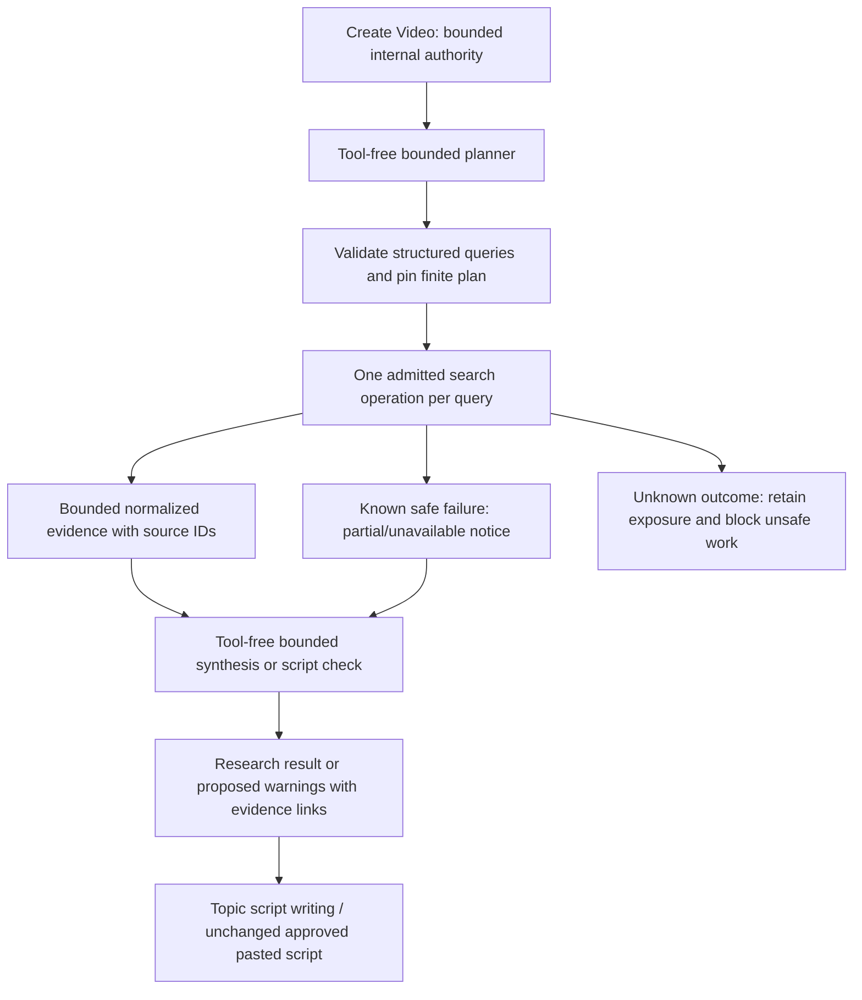

# S4-R — Deterministically bounded retrieval plus Gemini reasoning

Date: 2026-10-04. **S4-R: PASS at documentation/local-fixture architecture scope.** Recommended conditional path: Tavily **Basic Search REST**, finite application-owned queries, then tool-free bounded Gemini synthesis/checking. **Original S4 remains FAIL. S4 overall after remediation: PASS at the same conditional architecture scope**, using the owner's current clarification that research was the sole blocking S4 capability. No live provider compatibility, factual quality, final vendor activation, invitation economics or production implementation is certified.

[Predeclared plan](PLAN.md), [local witness](witness.json), [candidate/source inventory](candidates.json), [reproduction](../../../../spikes/research-feasibility/README.md). Previous text/image/TTS evidence is reused, not rerun or rewritten. Original alternative-model/quota/retention uncertainties stay visible: unknown optional models are not enabled; concrete account/endpoint/terms settings must be checked before adopting them. They do not become newly certified through this research witness.

## Requirements and experiment

Authority read: AGENTS/CLAUDE, docs index/product/architecture/gates, job/cost/artifact research contracts and original S4 source/JSON evidence. Product: factual topics research before writing; separate checking only for pasted scripts; both automatic/non-blocking, private sources/warnings, original wording unchanged without creator approval. Finite liability and initial plus at most two automatic retries survive restarts. An unknown external outcome retains holds and can exclude the global execution lane. The $30/month total includes all other production/host/storage/backup/failure costs; it is unchanged.

No existing implemented research adapter was reusable. Reused HTTPX 0.28.1 from the disposable S4 environment; no new SDK/dependency installed. A direct documented REST endpoint avoids vendor SDK retry ambiguity. Source-inspected HTTPX transport default is zero connection retries, hash in witness.json; any future real adapter must explicitly set retries=0, redirects off, trust_env=false, finite phase and whole-attempt deadlines. No transaction spans transport.

**Claim:** bounded planner + application-owned retrieval requests + bounded evidence + bounded tool-free checking can close the autonomous search-charge failure. **Failure sought:** excess queries/hidden pagination, regenerated plans resetting limits, redirects/retries, zero-cost timeout assumptions, lost provenance and unsupported citations/script mutation. **Predeclared pass criteria:** finite requests/fees, validated structured plan, <=3 attempts/operation across recovery, uncertainty holds, bounded returned/forwarded evidence, preserved sources and original script, credible permitted programmatic use/retention and small-cost plausibility. Full factual quality is deferred.

**Observed:** 16 local cases passed: six adversarial plans rejected before search; N=2/4/8 persisted plans, retries/restarts/repeated callers/refusal outside plan; ten uncertain/error/redirect/oversize/invalid-usage/result cases; quota admission; citation/script-preservation validation. Search HTTP was actual HTTPX against MockTransport, all sockets/DNS denied and environment cleared. Successful evidence survives a later failure; timeout has exactly one outbound submission and held money/credit. Unexpected higher credit usage raises recorded exposure and stops further execution rather than expanding authority. Planner/check responses are synthetic, not Gemini reasoning or factual-quality evidence. No failed witness run materially informed the conclusion.

## Small candidate set

Prioritized Google first, then Brave, then Tavily because Brave's ordinary retention rights did not fit. One documented public-corpus alternative was checked to establish why zero additional provider spending alone is insufficient. No search-engine HTML scraping, undocumented endpoint or broad provider comparison.

| Candidate | Suitability | Cost classification | Unit / allowance | Rates / results | Main constraint |
|---|---|---|---|---|---|
| Google Custom Search JSON API | Not a credible new Alpha foundation | CONDITIONALLY_BOUNDED for an eligible existing customer | $5/1,000 queries; 100 free/day; up to 10K/day | App controls requests; 1–10 results per request | Closed to new customers; ends Jan 1, 2027; no owner eligibility evidenced |
| Google Vertex AI Search alternative | Not selected for broad-web Alpha | UNKNOWN for this workflow | No adopted price contract | Google positions it for up to 50 domains | Domain corpus/configuration and indexed-service costs introduce another investigation; no claim it replaces general web research |
| Brave Web Search REST | Bounded financially, not usable for durable project evidence under ordinary terms | CONDITIONALLY_BOUNDED financially; retention unresolved | $5/1,000 requests; $5 monthly credits advertised | 50 QPS advertised; count<=20; bounded pagination if admitted | Storage rights require additional agreement; standard result-retention restrictions prevent unconditional recommendation |
| Tavily Basic Search REST | **Recommended conditional candidate** | **CONDITIONALLY_BOUNDED complete flow** | 1 credit/request; 1,000 free credits/month, no card required; conservative PAYGO $0.008/credit | Development 100 RPM; paid/PAYGO production keys 1,000 RPM; max_results<=20; chunks/source 1–3 | Explicit basic/auto_parameters=false; no agent/research/crawl/extract/answer add-ons; terms/entitlement and effective account limits checked before activation |
| Wikimedia Action API public-corpus search | Credible no-additional-paid-provider supplement, insufficient sole broad-web research | BOUNDED retrieval fee (zero); Gemini reasoning separately bounded | No paid search unit in documented public API | srlimit<=500; app must choose finite smaller value; variable throttling | Encyclopedia coverage cannot establish complete timely/primary-source checking of arbitrary factual scripts; attribution/license obligations |

Google status/pricing: [overview](https://developers.google.com/custom-search/v1/overview). It expressly redirects limited-domain use toward Vertex AI Search; a full-web alternative requires contacting Google. No service was created or contact sent. [Custom Search protocol](https://developers.google.com/custom-search/v1/reference/rest/v1/cse/list) is documented; eligible legacy use could bound query fees, but access/sunset is decisive, so no further SDK/terms audit was needed for adoption.

Brave request count/pricing and ordinary result-storage restrictions: [pricing](https://brave.com/search/api/), [web search](https://api-dashboard.search.brave.com/documentation/services/web-search), [terms](https://api-dashboard.search.brave.com/documentation/resources/terms-of-service), [retention FAQ](https://api-dashboard.search.brave.com/documentation/resources/help-feedback). Returned URLs/titles/descriptions/extra snippets would be useful; plain REST gives application retries. No search idempotency/result-recovery guarantee was established; timeout holds exposure, then owner billing/support reconciliation. Standard plan cannot be assumed to permit saving even part of results. Storage-rights pricing/contract is unknown; no contact, card, custom agreement or purchase authorized. Search API grants no publisher-content rights. [Rate headers](https://api-dashboard.search.brave.com/documentation/guides/rate-limiting) reflect plan windows; effective limits need account evidence.

Wikimedia permits documented programmatic consumption with identifying User-Agent, throttling and content-license compliance. Retain revision/source/license attribution when using content; no provider guarantee of factual correctness or fixed throughput. Unknown requests can consume service quota/resources even with zero search fees. No automatic corpus fallback adopted. [Search API](https://www.mediawiki.org/wiki/API:Search), [usage policy](https://foundation.wikimedia.org/wiki/Policy:Wikimedia_Foundation_API_Usage_Guidelines).

## Recommended complete flow

1. Before even the paid planner runs, Create Video supplies existing bounded scope/authority. Deterministic policy pins N, query/request/evidence/token bounds, rate basis and retry reserve, reserving shared budget and allowance. This introduces no new cost-review screen. Planner prices are never discovered through an unapproved paid call.
2. Tool-free bounded text planner returns `{"queries":[...]}`. JSON schema plus application validation enforces length<=N, strings, finite length and no unplanned fields/duplicate queries. Query byte/word limits are local reversible controls, not asserted provider limits. Over-N/malformed output is rejected before search, not silently treated as a complete plan; planner retries count against its same persisted operation. No model-generated endpoint, credentials, fee/count override or unlimited fallback is accepted. Pasted-script claims are associated with original text/version; query coverage is explicit, not a claim every fact was verified.
3. Pin the validated plan/version/signature; deterministic worker admits at most N distinct Search operations, one documented POST /search per concrete attempt. Explicit `search_depth=basic`, `auto_parameters=false`, `max_results=R<=20`, `chunks_per_source<=3`, `include_usage=true`, with answers/raw pages/images disabled. No pagination or automatic search-loop/Extract/Crawl/Research/agent. A manual new research plan is new scoped authority, not a retry-counter reset. Queries contain the factual search terms needed, not account/project IDs or the full private script by default.
4. Persist local attempt/config/query hash, monetary and quota hold, submission-start marker before transport; persist successful receipt before normalization. Record request_id and credit usage when returned; missing usage is not zero. Bound streamed response bytes, result count, URL/title/snippet bytes and total serialized evidence. Oversized/incomplete receipt is unusable/pending, not free. Local truncation marks coverage partial and does not reduce already incurred search fees.
5. Normalize query, source URL/title, retrieval time (distinct from source publication time), provider/endpoint/version/config provenance, provider/local request IDs, snippet/content, truncation markers and original-input association. Source IDs link the Research Result/Factual Warning back to actual retrieved evidence. Ignore model-generated URLs that have no matching retrieved record. Treat source text as untrusted input, not orchestration instructions. No publisher-site crawler/network fetch is necessary for this basic path; future extraction would need its own bounds and permissions.
6. Tool-free bounded Gemini synthesis/checking receives only bounded evidence and original input. No google_search tool, callable tools or implicit additional model turns. Use the already evidenced one-send configuration or Interactions submission guard. Validate structured output/claim-source ID associations. For topics, produce research/source context before writing. For scripts, produce private warnings/proposed changes only, leaving approved words immutable until individual/all-change acceptance. Coverage gaps, conflicting snippets and unsupported conclusions stay unverified/review-needed; never describe a snippet as full-page verification.

This architecture supports the product's factual workflow; it does not establish that N small queries catch all serious factual errors. Private factual acceptance remains the product's later measured quality gate. Snippets are relevant evidence, not proof of a fact in isolation.

## Tavily authoritative contract, rights and limitations

Programmatic POST /search is documented. Basic costs one credit, Advanced two; auto selection can raise depth, so pin it. Search response includes URL/title/content, request_id and optional usage. Small source chunks and bounded results are suitable inputs for evidence-linked checking; no full-page accuracy claim. [Search schema](https://docs.tavily.com/documentation/api-reference/endpoint/search), [credit prices](https://docs.tavily.com/documentation/api-credits).

No Tavily SDK is installed or certified: direct REST with HTTPX retries=0, no redirects, explicit timeouts and persisted admission is sufficient. A GET-looking API is not automatically free to retry. Unknown execution and billed failure classifications remain conservative; 429/5xx do not by themselves settle liability. Rates are key-environment based; free keys use Development, paid/PAYGO required for Production. Effective account entitlement must be captured later, not inferred from labels. [Rate documentation](https://docs.tavily.com/documentation/rate-limits).

Terms expressly permit integration into Customer Applications and distinguish Output from Services. Public docs demonstrate RAG/vector-store/export workflows; no Brave-style blanket storage prohibition was found. **Inference:** retaining bounded project evidence/source references for the supported RAG use is a credible conditional path. This is not a blanket copyright license or perpetual redistribution right. Keep output/source attribution and applicable publisher permissions; no mirrored corpus, search-result resale, training or claim of human-generated AI output. Exact accepted account/order-form restrictions must be retained before activation; conflicting terms disable this candidate. [Terms](https://www.tavily.com/terms), [official persistence/RAG examples](https://docs.tavily.com/examples/quick-tutorials/cookbook), [downstream acceptable use](https://www.tavily.com/acceptable-use-policy).

Privacy is not magically solved by separation: query data may be retained/improve services and reach third-party indexes; contractual AI-functionality provisions may allow retention/training. Send minimal factual queries, not complete scripts or identifying metadata; this is data minimization, not a guarantee of anonymity. Record actual provider retention/privacy settings and ensure existing privacy/deletion duties before invited use. Do not promise provider-side seven-day deletion or enable a new retention exception. Local project evidence follows accepted project deletion/purge; non-content financial records remain separate. No provider account or contract was activated here. [Privacy policy](https://www.tavily.com/privacy).

## Unknown outcomes and reconciliation

Classification: **PARTIALLY_RECONCILABLE**. Success captures `request_id`/`usage.credits`; replay of saved evidence is local recovery, not a new search. Search has no established idempotency-key or asynchronous result-retrieval/cancel contract. Timeout after possible receipt holds one maximum request fee **and** credit, blocks automatic retry and any unsafe overlapping paid execution. Cancellation/lease expiry/month rollover do not erase that hold. A free-credit request also reserves quota; duplicate execution can consume another credit or move into paid overage.

Account `/usage` gives key/account usage/limits; only aggregate attribution. Its documented throttle is ten requests per ten minutes; don't poll per search or assume instantaneous settlement. Paid/PAYGO `/logs` provides request ID/timestamp/endpoint/depth/credits, never input/output; free accounts cannot use it. Neither absence from logs nor a usage delta guarantees a lost request never executed; no complete retention/latency guarantee was established. Owner investigates available dashboard/logs/billing/support evidence; if unresolved, liability persists until supported reconciliation or explicit duplicate-charge-risk authorization. Do not turn PAYGO on just to obtain logs. No logs/usage call made. [Usage](https://docs.tavily.com/documentation/api-reference/endpoint/usage), [logs](https://docs.tavily.com/documentation/api-reference/endpoint/logs).

Known non-submission failures may retry within original authority, total <=3 attempts per operation. No provider-specific status is automatically classified zero-charge by these mocks. Valid previous evidence is preserved; unknown remote execution can still pause other paid generation despite non-blocking *content* policy. Once safe terminal failure/cessation is established, continue authorized production with research-unavailable/checking-incomplete notice, partial sources and retry access. Never claim checking succeeded.

## Maximum-liability model

Let A_P, A_S and A_i each be 1–3 authorized attempts for the fixed planner, synthesis/check and query i. Let N be a deterministic maximum queries, c=1 credit for pinned Basic Search, p be the versioned maximum applicable price per credit. Let T(I,O) be the bounded tool-free Gemini maximum, including all inputs and thoughts/output, conservatively rounded per attempt. Then:

`L = A_P*T(I_P,O_P) + sum(i=1..N, A_i*c*p) + A_S*T(I_S,O_S) + applicable bounded taxes/fees`

No duplicate addition of a separate retry reserve: A already includes it. No planner-driven extra request/turn/pagination. All amounts integer microUSD, credits independent integers. Aggregate quota holds include possibly submitted free requests and concurrent/external account usage; free credit may reduce cash only after verified entitlement/allocation. Default reserve uses p=$0.008 and ignores free credit. No $30 subscription selected: it alone consumes the entire total ceiling. Use verified no-card free Researcher entitlement, PAYGO disabled, as the least-cost adoption candidate; paid use would require explicit owner authority and ordinary budget admission. Published free allowance is not an unconditional permanent guarantee.

Example technical/economic exploration range **N=2–8**, not a production setting or coverage guarantee. At current conservative paid tariff, search initial costs $0.016–$0.064; worst three-attempt search reserve $0.048–$0.192. A verified 1,000-credit allowance supports 125–500 such first-pass plans, or 41–166 worst-retry plans before any other account use. These are arithmetic capacity examples, not projected tester behavior.

Using the evidenced Gemini 3.5 Flash-Lite standard text rates (input $0.30/output $2.50 per million tokens), example planner output cap 1,024 and synthesis cap 4,096 include thoughts. Full serving-input fallback I=1,048,576 gives complete three-attempt research reserves **$1.973838–$2.117838** for N=2–8 before taxes/fees. This is finite and conservatively admit-or-block; not expected spend. If independently validated exact prepared-input token budgets are 8,192/16,384, corresponding reserves are **$0.108522–$0.252522**. The witness uses synthetic token budgets and does **not** prove tokenizer/preflight accuracy; use serving-cap fallback unless a tighter input-bound mechanism is established. Input/result byte limits alone are not a proven token count. [Existing S4 bound evidence](../provider-feasibility/S4.md), [thinking/output cap](https://ai.google.dev/gemini-api/docs/thinking).

A small bounded research expense or free search is plausible alongside the unchanged $30 ceiling, not a demonstrated complete operating envelope. Reserve host/storage/backup/other generation/failure obligations first; when a complete authorized research bound doesn't fit, block admission instead of reducing content silently. Final N/R/token tuning and cohort economics belong to measured validation/S9. No monthly research budget was fixed here.

## Closure and S5 readiness

- Original S4: **FAIL**, unchanged historical report/JSON and autonomous Gemini Search classification.
- S4-R: **PASS**, a credible conditional complete bounded architecture exists: application-limited Tavily Basic Search plus tool-free bounded Gemini planner/reasoning; no autonomous Gemini Search.
- Overall S4 after remediation: **PASS at documented conditional architecture scope**. Required retry isolation, provenance, finite bounds, partial reconciliation and dated TTS quota evidence remain mandatory. The user explicitly identified research as the sole prior gate blocker; this closure does not certify previously optional unknown endpoints/account settings or erase those findings. No other material architecture blocker was exposed by this narrow investigation.

**S5 may proceed from the S4 architecture-dependency perspective, after separate authorization and an exact finite experiment plan.** No S5 call is authorized or executed here; TTS account-tier/refresh evidence, remaining quota, bound/rate/fees, retries and duplicate-charge risk must be checked for that specific plan. This research recommendation is not final narration/provider selection. S6/S9 remain unexecuted.

No live call is necessary for this conditional architecture verdict. Real search quality/terms activation/effective-account behavior remains future validation, not an invented universal guarantee. If later a live experiment becomes necessary, specify endpoint/count/purpose/free-or-paid/maximum liability and wait for owner approval. No keys were read; no email/contact sent; no provider/search call, paid operation, purchase, deployment, production implementation or TASKS.md occurred.
