# Job execution, recovery and failure model

Status: accepted authoritative Private Alpha architecture model, confirmed on 2026-10-03 with [ARCHITECTURE.md](ARCHITECTURE.md), subject to its evidence gates. Design acceptance does not authorize implementation or establish feasibility. This document is authoritative for execution states, exclusion, retries, progress and failure recovery. It does not create implementation tasks.

Narration operation amendment: **accepted by the user**, 2026-10-03. Other execution policies remain accepted.

User clarification: creator review or display of estimated cost and maximum spend is optional, not a prerequisite for paid authorization. Create Video itself authorizes bounded production and starts generation directly, with no intervening estimate, confirmation or review screen. Financial details may remain in optional Details. Server-side cost bounds, allowance/budget reservations, retry limits and reconciliation remain mandatory. Required script-preservation/translation/adaptation approvals and material scope changes remain distinct from routine cost review.

## Durable execution decision

**Decision:** Use a relational job/operation/attempt queue and one supervised Python production worker. Domain services own deterministic transitions. No Redis/Celery/managed broker or workflow platform is required initially. Web requests persist commands and return; polling reads durable status/events.

**Requirements:** One active production request, long-running AI/media, targeted retry, crash recovery, partial completion and transactionally controlled spend.

**Alternatives:** Request-background callbacks; direct CLI execution; broker-backed workers; general workflow platform.

**Tradeoffs:** A database queue reduces infrastructure, but explicit state/exclusion/idempotency still require careful design. A broker alone would not solve provider exactly-once execution, financial authority or stale selections.

**Reversibility:** Queue delivery can move later while retaining domain job/attempt state. Do not make the queue transport the sole durable workflow history.

**Evidence needed:** Concurrent claim/admission, crash windows, ambiguous external requests, child termination and lock recovery.

## Job, operation and attempt

| Record | Purpose |
| --- | --- |
| Job | One creator-authorized execution request: initial production, scoped regeneration/checking or rendering. Holds project/scope, immutable authorization/configuration links and aggregate progress. |
| Operation | A deterministic step with exact relevant input versions, expected typed output and allowed retry policy. One image/audio/text capability or local transformation; any multiple paid submissions are explicitly represented. |
| Attempt | Concrete execution, prepared before an external submission or local child starts. Stores worker fencing identity, request identity, started/completed times, safe outcome, response-recovery references and usage/cost certainty. |
| Execution ownership | Persisted global lane owner and attempt fencing token, coordinated with supervised host-process exclusion. |
| Progress event | Durable stage/scene/attempt event; successful required outputs determine completion, not an exit code or optimistic percentage. |

An initial pipeline may reveal scene operations after script planning. Deterministic code validates their count/scope/configuration and financial bounds against the approved execution policy before creating/admitting them. LLM-generated scene IDs/counts do not grant permission for arbitrary paid calls. If remaining authority cannot cover the concrete plan, pause for confirmation rather than silently reduce content or exceed the ceiling.

Original-input routing is explicit: factual topics → research → script/scene planning; pasted scripts → non-blocking checking and consent-controlled changes → scene planning. Voice annotations cannot alter approved words. The existing extra humanization/voice-direction paid calls are not automatically mandatory stages.

## Narration operation scope — accepted amendment

A scene editing action is not a provider attempt. TTS operations pin a narration-generation segment version and its full ordered scene/text/configuration/context inputs; one multipart request remains one concrete submission. Alignment/mapping and project assembly are separate local operations, reusing immutable source audio. A failed/ambiguous segment attempt names its affected scenes, preserves other compatible segments and follows the existing retry/reconciliation rules. No hidden subrequests or reset retry counters when splitting/replanning.

Before paid work, bind the actual scene/segment/request scope and bounds internally. Explain material correction scope to the creator; financial review/display is optional. A queued member edit requires refreshed segment planning/authorization; a running member edit makes the returned segment source history-only. Do not silently select unaffected sibling ranges from a stale response. Edits unrelated to all pinned inputs leave compatible operations eligible. A different segment duration requires local global-offset/assembly updates, not regeneration of later sources. Progress distinguishes generated source, validated mappings, compatible current scene coverage and final assembly; completed TTS alone is not complete narration. Known quota waits are cancelable and checkpointed; ambiguous paid outcomes retain liability and any required global-lane exclusion.

## Job state machine

Blocking reason is separate from state so financial waiting is not confused with failure or cancellation.

```mermaid
stateDiagram-v2
    [*] --> Waiting
    Waiting --> Queued: Inputs authorized and reservations admitted
    Queued --> Running: Worker claims global lane
    Queued --> Waiting: Relevant inputs or limits changed
    Running --> Waiting: Safe checkpoint needs approval/budget
    Running --> RecoveryRequired: Execution or paid outcome uncertain
    Running --> Cancelling: Cancel requested
    Running --> Completed: Required operations satisfied
    Running --> Partial: Some required outputs failed/missing
    Running --> Failed: Cannot continue; no sufficient completed scope
    Cancelling --> Cancelled: Cessation confirmed
    Cancelling --> RecoveryRequired: Cannot confirm cessation/outcome
    RecoveryRequired --> Waiting: Reconciled and safely resumable
    RecoveryRequired --> Cancelled: Confirmed stopped and cancelled
    Waiting --> Cancelled: No execution outstanding
    Queued --> Cancelled: No execution outstanding
```

- **Waiting:** reason may be user confirmation, budget/allowance, storage, inputs or operational availability. It owns no active slot only if running work has stopped. Unknown submitted liability is retained.
- **Queued:** authorized eligible work with admitted reservations; position is visible. Eligible jobs follow request order; blocked requests do not monopolize the lane. Revalidate at execution and before each paid submission.
- **Running:** one request owns the global lane throughout sequential active steps.
- **Cancelling:** no new operation starts; local/provider termination is being attempted.
- **RecoveryRequired:** outcome/exclusion cannot be proven. Not a generic automatic retry state. Retain relevant reservations and any execution guard necessary to prevent overlap.
- **Completed:** this request fulfilled its defined operation scope. It is not automatically a publishable project or current final video.
- **Partial/Failed:** expose the specific failed/missing outputs and preserved successes. No incomplete production reported as complete.
- **Cancelled:** confirmed no further execution for the canceled request; outstanding accounting can still require reconciliation. If a remote operation's cessation is unknown, do not claim confirmed cessation.

Terminal jobs remain immutable history. A manual retry/resume request references that history and a new explicit authorization for remaining work. It reuses compatible successful results; it does not reset paid history or erase old retry counters. A stale successful result can complete an operation into history while the project remains in need of current output; present both facts rather than falsely claiming a current finished video.

## One active production lane

The lane is global across users/projects and includes initial production, targeted regeneration, research/check retries and final rendering. Paid work cannot bypass it through a preview or helper endpoint. Cached voice/media preview is a read; any new paid preview would need ordinary authorization/queue treatment and is not an unrestricted implicit capability.

Pauses for user confirmation or exhausted budget release the lane only after execution stops. An HTTP timeout or expired heartbeat does not establish that an old provider request or FFmpeg process stopped. Unknown remote execution may therefore block production until supported evidence reconciles it. This is the conservative consequence of A1/A4, not a promise of uninterrupted autonomous recovery.

Use host-level worker/process supervision plus persisted ownership/fencing. Claim the lane and operation in a short transaction. Before each new paid call, verify current fencing, cancellation, relevant inputs and financial reservation. Before publishing/selecting outputs, verify again. Lost ownership forbids further submissions/current selection; a stale worker's valid bytes may be reconciled only as recorded history, never as a competing current result.

Supervision must terminate/observe old media children before replacement. Record process group, process-start identity and boot identity where applicable; a reused PID is not proof of ownership. Lease expiry triggers recovery inspection, not immediate overlapping execution. Database unavailability stops new calls; fencing alone cannot stop already submitted external work.

## Idempotency and checkpoints

Repeated web commands carry an idempotency identity scoped to actor/project/action; duplicate Generate/cancel/retry submissions cannot create duplicate jobs/reservations. Operations identify their exact input/configuration signature and attempt history. Restarts do not infer completion from nonempty filenames.

Checkpoint after validated durable artifacts and ledger transitions. A provider submission must have an already committed prepared attempt and reservation. If a crash occurs after preparation but before proof of submission, treat the outcome as uncertain unless evidence proves no external call occurred. If provider output survives in the response spool, validate/register it without another call. If file installation precedes metadata commit, reconcile the immutable key/hash against the attempt manifest.

Local transformations may rerun idempotently against pinned inputs. Paid calls may repeat only when prior outcomes are known and retry authorization exists. An LLM never decides whether an attempt may be retried, whether its result is current, or whether a reservation may be released.

## Retry and cancellation

At most two automatic retries per failed operation, persisted across restarts, and always inside approved limits. Distinguish known retryable failures, permanent invalid inputs/configuration, ambiguous submissions, and persistence errors after provider success. A new attempt needs a new reservation allocation within the same authorized ceiling; SDK-hidden retries must not bypass this.

Backoff waits are visible/checkpointed and cancelable. Stop after the retry limit and offer manual retry with a fresh displayed plan/authorization. Never regenerate a charged successful response just because its local save failed.

Cancel prevents all new work, attempts remote cancellation if supported, and stops local process groups with escalation/observed exit. Valid already-submitted late output is saved as history, not selected, and consumes allowance if delivered. Unknown cost retains liability until reconciliation. Rendering retry/cancel never discards source assets or the last valid export.

## Project edits, locks and deletion

Asset generation permits edits. Relevant queued changes require refreshed authorization; relevant running changes produce historical results. Continue only unaffected authorized work, not downstream tasks that assume edited outputs are current.

Final rendering locks all content changes after validating its manifest. Cancellation/failure/completion releases the lock only after cessation is proven. Previous exports are viewable/downloadable throughout. Recover stale locks using execution evidence, not a timestamp alone.

**A14 no-deletion rule (the in-flight deletion proposal was rejected):** Deletion is prohibited during active generation as well as rendering. The creator must cancel and wait for confirmed cessation before deleting. A queued, never-started request can be canceled transactionally when an otherwise eligible project is deleted; a claim/delete race must result in either a successful deletion with no launch or a deletion rejection because execution won. Recovery-required outstanding execution cannot be treated as safely stopped. No in-flight deletion policy from the rejected proposal is retained.

## Failure matrix

Staleness follows source changes in the artifact model, not failure alone. A failed attempt does not invalidate unrelated or earlier compatible artifacts.

| Failure | What survives / compatibility | Recovery and cost | Creator/owner sees |
| --- | --- | --- | --- |
| Provider timeout | Committed assets and prepared attempt; submitted result/cost may be unknown | No blind retry; retrieve/reconcile or establish safe terminal outcome; retain financial exposure | Paused operation and pending owner reconciliation |
| Rate limit | Completed outputs and request record | Bounded delayed retry only if outcome/cost classification is known and authorized; up to two automatic retries | Rate-limit wait/retry count or manual retry |
| Invalid provider output | Previous valid versions; invalid payload in private diagnostics if safely retained | Known-outcome retry if policy permits; paid failure belongs to actual spend, not successful allowance | Validation failure at named stage/scene |
| Image failure | Other images/audio and prior compatible image | Targeted retry or image replacement; paid retry requires authority | Failed scene and preserved work, no silent placeholder |
| TTS failure | Unrelated compatible segments/images and prior source/mapping versions | Targeted segment retry with disclosed scene/request scope; recover paid output before another call | Failed segment and affected scenes, preserved work and cost history |
| Alignment failure | Valid narration/text/images remain | Local rerun/correction or explicit alternative; operating compute cost, no generation allowance for local work | Failed/incomplete timing; required export blocked |
| FFmpeg failure | Source artifacts, previous export, safe attempt scratch | Confirm child exit, unlock, retry local render; actual operating cost only | Failed render, retry, previous export |
| Process crash | Committed database/media and attempt spool | Inspect child/external outcome; replay local checkpoints only; paid uncertainty reconciled | Recovering or reconciliation-required status |
| Web server restart | Durable queue/worker/project data | Requests reconnect; worker continues if healthy; duplicate commands deduplicated | Durable status rather than lost job |
| Worker restart | Committed checkpoints and ownership/attempt history | Stop old children, reconcile unknown requests, then claim/resume | Recovering; progress resumes from known outputs |
| Storage failure/full disk | Registered intact files/metadata; new result may remain provider-retrievable | Stop admission; preserve received paid bytes where possible; local repair/reconcile before retry | Storage blocked or incomplete persistence |
| Database failure | Previously committed state/media; active attempt may become uncertain | No new paid call/publication; recover database and reconcile spool/external state | Service/recovery notice; no invented success |
| User cancellation | Existing successful assets; valid late outputs in history | Stop new calls; confirm local/remote cessation; spent money not automatically reversible | Cancelling/cancelled plus known/pending usage |
| Concurrent edit | New edits and all valid historical results | Compare relevant source signatures; no current overwrite; new paid regeneration reauthorized | Outdated/review-needed items and historical usage |
| Stale provider response | Valid output/provenance and cost once | Keep history; never auto-select or run current downstream work from it | Previous version, current work still incomplete if needed |
| Budget/allowance exhaustion | All completed work and held liabilities | Queue/pause new work; explicit owner revision or later eligible period; no silent expansion | Budget-blocked status and preserved work |

Research/checking failures are explicitly non-blocking: record partial sources/unavailable status and continue other authorized work without claiming verification succeeded. Provider uncertainty still cannot bypass financial/execution safety; non-blocking content policy does not authorize an uncontrolled duplicate request.

## Minimum progress and history

Expose job scope/state, current stage/scene, completed required operations, specific failures, retry count, queue/blocking reason and known/pending costs. Use FFmpeg machine progress for local rendering; for providers without progress, show activity/stage rather than fabricated percentages. Store safe structured events and durations, with private scripts/media excluded from routine logs.
