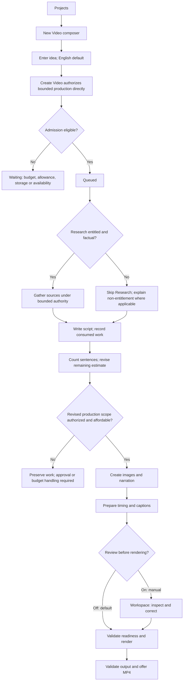
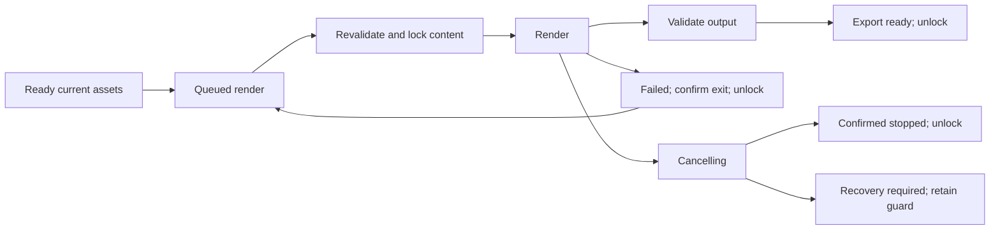

# Alpha creator flows

## Entitled Research and optional topic discovery — 2026-10-05

The [Alpha specification](ALPHA_PRODUCT_SPEC.md#owner-decision--research-entitlement-and-topic-discovery-2026-10-05)
owns the four-feature entitlement matrix. Research, Topic Suggestions and Custom
Topic Suggestions are only for 3 videos/week or 1 video/day; Expert Topic
Suggestions is only for 1 video/day. Lower tiers cannot invoke them through
hidden routes or client plan claims. Feature entitlement is checked server-side
before work, independently of financial admission.

Conceptual optional New Video branch: **Need an idea?** → choose one distinct
suggestion feature → request/inspect ideas → explicitly use a topic in the
existing composer → Create Video under its ordinary authority. Another stored
random suggestion needs no LLM. Custom takes one or more categories/interests
and uses `gemini-3.8-flash`; Expert takes a channel, creator/channel name, channel
link or niche. Neither idea generation nor selecting an idea starts paid video
production. Preserve current composer content until an explicit replacement.
Suggestion counts, saved history and quota/credit behavior remain undecided.

Keep this branch beside the composer, without a required topic-discovery screen,
new dashboard or redesigned creation flow. Explain unavailable features with a
clear eligible-plan requirement; exact upgrade/paywall UX remains unresolved.
Entitled AI discovery follows bounded authorization, queue/usage and failure
rules; do not invent daily quotas or a new service. Channel retrieval failure
or private/unavailable channel cannot become a fabricated successful inspection.

For factual topics with Research entitlement, research before writing as already
specified. Without entitlement, skip Research and disclose that it is not
provided; do not claim sources were gathered or expose an unauthorized retry.
Keep factual-quality requirements and pasted-script checking policy unchanged.
The three discovery features have **no first-Alpha delivery commitment**; release
timing and assignment of private-Alpha account entitlements remain open.

Owner S9 v5 estimate-display amendment, 2026-10-05: Alpha creators see **both
estimated credits and estimated USD**, superseding v4's credits-only decision.
Use the existing compact estimate and optional Details pattern, without a
mandatory review screen. Topic default is five minutes; preliminary credits =
requested minutes / 5, preliminary images ~12/minute. Known scripts instead use
deterministic sentence count. Consumed usage, remaining estimate and projected
total remain distinct. USD bounds are internal financial authority; post-script
credit/debit, correction and reset rules remain open.

Status: accepted Alpha UX baseline, confirmed by the user on 2026-10-04. Creator flows are authoritative under the repository hierarchy. Direction C Refined is the accepted visual/motion evidence and discovery/exploration is closed; application implementation, architecture spikes, paid calls, deployment purchases and TASKS.md generation remain unauthorized. [DESIGN.md](DESIGN.md) defines presentation. [Product specification](ALPHA_PRODUCT_SPEC.md), [artifact model](ARTIFACT_MODEL.md), [job model](JOB_EXECUTION_MODEL.md) and [cost model](COST_MODEL.md) remain authoritative for scope, compatibility, execution and finance.

Default paths minimize decisions. Optional paths customize or inspect. Exceptional paths preserve successful work and explain the safe next action. A completed operation, a current project and a validated export are distinct outcomes.

Reconfirmed during final design reconciliation: creator review or display of estimated cost and maximum spend is optional, not a prerequisite for paid authorization. Create Video itself authorizes bounded production and starts generation directly, with no intervening estimate, confirmation or review screen. Financial details may remain in optional Details. Server-side cost bounds, allowance/budget reservations, retry limits and reconciliation remain mandatory. Required script-preservation/translation/adaptation approvals and material scope changes remain distinct from routine cost review.

## Entry and guided demo

**Default:** Landing → Try the workflow → clearly labeled prepared example → example input → demonstration production stages → scene workspace → play supplied final video. Sign in is secondary and serves invited accounts; no public signup/billing is required.

**Optional:** Inspect narration/visuals, move between scenes, view example timing/captions and learn how correction/authorization works. Skip walkthrough and inspect the result; reset the demo. Use repository `demo-video-example/` files, not live providers. Do not derive a live-generation claim from simulated progress. No real cost, job or allowance reservation is created.

**Exceptional:** Missing/unplayable demo media shows an honest unavailable state. No placeholder is represented as a successful output. Before publication verify media permission, privacy and correspondence between actual audio, scene words, timing and exported video. A demo edit must not make unchanged recorded narration look current; without a prepared alternative, explain the next action instead of fabricating it. Demo interaction never mutates the supplied source files or another visitor's project.

The landing presents three generated-video images together, the middle slightly larger. Automatic movement advances horizontally right-to-left with a viewing pause and clean loop. Previous/Next and Pause/Play are quiet controls; hover/focus pauses, touch pauses until explicit resumption and hidden tabs stop advancement. Reduced motion stops automatic movement while manual navigation remains. Manual image changes can be announced; automatic changes do not continuously announce. This media interaction does not start generation or narration playback.

## Default topic → video

Default settings: English, approximately five minutes, Minimal Illustration, default supported voice, captions on, gentle motion on, music off. No mandatory title, provider/model choice or project setup. The initial centered composer exposes only a concise heading, dominant input, integrated Create Video and quiet See more, with a compact current-interpretation hint. A provisional project name can derive from input and remains renameable; this is a local presentation detail, not another required input.

Cost-free planning establishes a bounded internal request. Create Video authorizes the submitted input/settings and system-enforced spending ceiling without a mandatory review screen, including applicable entitled Research and required text/images/narration and the initial render's scope. Local rendering consumes no tester generation allowance but remains subject to operating budget and queue constraints. No paid planning runs before authorization. If a trustworthy bound is unavailable, show that generation cannot yet be authorized; never invent a price.

For Research-entitled users, factual-topic research is automatic and non-blocking. Lower tiers receive no Research and a clear plan-requirement explanation; this does not waive factual-quality criteria. Sources and warnings remain private. Generation does not require a routine script approval. Pause only for accepted approval/financial/compatibility requirements; do not add unnecessary checkpoints. Default production progresses to the initial render once ready. If concurrent edits make content outdated, pause for correction/review and renewed authority where necessary; do not render known-outdated assets.

Before script generation, topic estimates use duration credits and ~12 planned
images/minute, not an image cap or guaranteed cost. Once the script exists,
replace that image estimate with the deterministic sentence count (one planned
generated image per sentence), retaining already-executed research/script usage.
Within the existing Details/progress surfaces, distinguish consumed credits/
recorded USD, remaining estimated credits/USD and projected total. If a figure
is unknown, identify the pending component; do not display an invented exact
total. Recalculated scope exceeding sufficient authority or budget pauses the
affected paid production with successful work preserved, rather than silently
generating every sentence's image. No new universal materiality threshold or
routine script-review requirement is introduced.

## Pasted script → video

**Default for script input:** New Video composer → paste complete script (opens See more) → explicitly choose My approved script → Create Video starts generation directly in place. Script selection replaces topic duration with words-based duration information; output language is in the extension and defaults to English. Preserve submitted original separately. Check facts automatically and non-blockingly; plan scenes without rewriting approved words. Continue to images, narration, timing/captions and initial render under the same simple/manual choice.

For image estimation, deterministically count the approved pasted script's
sentences immediately: predicted images = sentence count. A five-minute estimate
must not override known scope with 60 images. Credit requirement derived from
that actual production scope remains pending the explicit post-script policy;
duration information alone is not a financial grant or final credit debit.

**Optional:** Select another supported output language or accept factual proposals. Individual/all-change acceptance displays the proposed words and updates the current script only with consent. It is not spending authorization. Warnings/sources do not appear in the video.

**Exceptional:** If pasted language differs from output language, require approval of translation before adopting translated words. Above ten minutes, require creator shortening or approval of a proposed adaptation. Show its changes and duration; never silently truncate. Shorter landscape scripts remain unchanged and are never padded without approval. Paid translation/adaptation proposal work must be bounded and authorized before running; cost review is optional; proposal acceptance and paid generation authority remain separate. Changed approved words require a current internal cost bound before affected paid production continues; quote review is optional.

Checking unavailable produces a private Checking incomplete notice, retained sources and retry access; it does not imply success or normally block other authorized work. Financial uncertainty from a checking attempt still follows safe reconciliation rules.

## Optional customization and manual review

See more expands controls within the composer; See less collapses them while retaining text and selections. It does not navigate to a settings page. Offer input interpretation, output language, topic duration, accepted curated styles, supported cached voice previews, captions, gentle motion, library music, Review before rendering and optional estimate/maximum-spend Details. Output language is in this extension rather than competing with the default input. Existing defaults apply while collapsed.

Interpretation is idea/instructions by default, with a visible quiet hint. Explicitly select My approved script to preserve submitted words; switching interpretation does not replace or discard the entered text. Paste opens options but does not select a mode, infer intent by text length or rewrite text. There is no post-click classification/interpretation screen. Ambiguous input is never silently reclassified; the chosen interpretation governs the action. No new automatic detection policy is introduced.

Create Video is disabled for empty input. For nonempty input, its click authorizes the bounded request, collapses optional controls and transitions in place to queue/progress without an estimate/review screen. Show actual admission/running/blocked state from execution evidence. The prototype's locked input and manual progress-state buttons do not establish a production edit-lock rule or real generated output. Script translation/adaptation approvals remain required separately. Music starts off; no unsupported provider previews, custom voices/styles or model tuning.

English is default. Spanish, French, Bangla and Hindi are experimental and only enable after narration, caption display and export verification. Do not imply the English acceptance set validates them. No vertical aspect-ratio selector in the initial release.

Manual review is the optional Review before rendering setting, default off. When on, completed generation opens the same workspace in Ready to review state; Render is explicit after inspection/correction. Simple path auto-renders its first ready version. Later corrections do not silently trigger another render or paid regeneration; the creator explicitly regenerates affected assets and renders again.

## Authorization, queue and progress

Before a correction action, make affected content scope and relevant creative configuration clear. Financial review is optional: See more/Details exposes estimated usage, maximum authorized spending and allowance impact. Create Video authorizes directly; no mandatory financial acknowledgement or intervening confirmation is required. Details exposes underlying model/configuration basis, expected output/request scope and per-attempt bounds when relevant, without requiring provider knowledge. Any queued request binds submitted input/settings versions and its internal financial bounds, whether or not Details was opened.

**Default:** Create/Regenerate → in-place admission status → server checks ownership, authoritative feature entitlement where applicable, inputs, allowance and shared budget → reserve eligible exposure → show queued state → run. Do not label work admitted or running before execution evidence supports it. Repeated clicks do not create duplicate work or deductions. Queue position is shown when known; only one production request runs globally, including generation, checking retries, regeneration and render.

**Optional:** Open Details for estimate/ceiling, reserved allowance, consumed allowance and pending usage; these must not be collapsed into one misleading balance. Failed paid attempts may use owner budget without consuming successful-output allowance. Technically valid delivered outputs consume allowance even if disliked or retained only in history.

**Exceptional:** Relevant queued edits pause affected work for a refreshed plan and confirmation. Compatible completed outputs survive. Changed provider limits, scene scope or required fallback that exceeds reviewed authority likewise needs a new quote/approval. Never quietly split paid requests or increase spending. Blocked requests show their reason without pretending reservations were admitted or occupying the lane merely because they are waiting.

Progress communicates actual stages and completed required work. Use Gathering sources / Checking facts / Writing script / Planning scenes / Creating images / Creating narration / Preparing timing and captions / Rendering video as applicable. Audio received is not narration ready until scene coverage/timing is valid. Counts such as images completed are valid; provider percentages and unmeasured completion-time promises are not. Private sources and warnings remain available alongside progress.

## Approvals

| Trigger | Creator reviews | Result of approval |
| --- | --- | --- |
| Pasted-script factual proposal | Original/proposed claim and sources; individual/all changes | Adopt approved words; no automatic spending grant. |
| Translation/adaptation | Proposed words, selected language and estimated duration | Adopt approved script version; refresh affected authorization. |
| Revised generation scope | Exact affected scenes/configuration and estimate/ceiling | Authorize only the newly reviewed bounded work. |
| Audio restoration with changed words/settings | Historical text, effective voice/delivery and affected scope | Adopt approved text/audio and scene-scoped settings; validate dependents. |
| Visual review after narration edit | Preserved image against new narration | Explicitly keep it or replace/regenerate; paid regeneration separately authorized. |

Factual warnings alone do not force approval or prevent progress. Declining a proposal preserves approved words. Dismissing a dialog does not approve it. While rendering, accepting text corrections or restoring assets is prohibited.

## Scene correction and narration

**Default:** Select a scene → selected preview and narration/visual controls → edit narration → immediate autosave → affected audio, timing, captions and final render become outdated. Original input stays unchanged; current script follows scene words/order. Preserve image and mark visual review. Show saved/error state; never claim a failed save succeeded.

**Optional:** Keep image explicitly, inspect audio/history, change supported effective voice, or edit visual instructions. Voice settings identify scene overrides versus project defaults. Captions/timing/motion/music are secondary views. Full-video playback is available separately from the selected-scene preview.

**Regeneration:** Inspect actual narration scope beside the correction → optionally inspect estimate/ceiling in Details → Regenerate narration authorizes bounded work → queue/run → validate audio/mappings → select only if current → refresh compatible timing/captions and local assembly. Example explanation: “This scene shares narration with Scenes 13–21. Regeneration updates their audio together; their approved words stay unchanged.” Show actual scenes, effective voice, request scope and manual work requiring review. Segment boundaries and surgical scene-only correction remain evidence-gated, not promises. Preserve unrelated segments/images; any fallback/new paid request must fit reviewed authority or pause.

**Exceptional:** An edited member of a running audio segment makes arriving full audio history-only; do not silently select sibling ranges. Show delivered historical usage and remaining current work. Invalid/failed mappings preserve source audio but block export until repaired. No blind paid regeneration when local audio extraction/alignment/joins fail. Safe local repair reuses sources; paid repair needs a new authorized plan.

## Image regeneration and replacement

**Default:** Select Visual → inspect current image and plain-language description → edit description or disclosed generation prompt → explain old image no longer fulfills new instructions → optionally inspect cost Details → Regenerate image authorizes bounded work → preserve prior version → validate/select current compatible result.

**Optional:** Replace image using a local uploaded file → show validation → select validated image → invalidate render only. Narration/timing/captions survive. Exact type/size/dimension limits remain operationally deferred; display real configured limits when available, never invent them here. No arbitrary remote-URL import or uploaded video/audio workflow.

**Exceptional:** Failed generation preserves other images and any earlier compatible selection. If no usable visual exists, show missing image and retry/replacement options; render remains blocked. Explicit scene deletion can remove the blocker when permitted. After narration edits an existing image can be explicitly kept with review provenance; do not silently pay for replacement.

## Captions, timing, motion and music

Caption text editing preserves spoken narration. Caption style/toggle, gentle motion, library music/volume and timing change render readiness without paid image/narration regeneration. Correct captions in a secondary view with associated words/audio and readable timing fields. Preserve manual versions when refreshed automatic output is proposed; do not silently discard incompatible manual corrections.

Timing adjustments must flag cut-off speech, gaps/overlap or invalid coverage. Required audio/video timing remains valid even with captions off. Enabled outdated/unresolved captions block render; disabling captions removes only that branch's blocker. Local alignment/assembly is not a generation allowance charge, though operating cost applies. Recomputed later global offsets do not imply regenerating later narration sources.

## Version inspection and restoration

**Default:** Image/audio History → open contextual edge panel/sheet → inspect relevant versions → compare thumbnail or listen/read associated words → choose Restore. Show current selection separately from last failed attempt. Provenance and usage are available through Details; no branch graph.

**Optional:** Restore existing image without generation allowance. Restore audio with compatible timing/captions when available. If words differ, require restoring text/audio together and update script. Show recorded voice/delivery; approval adopts it for that scene only and does not alter siblings/project defaults. Preserve incompatible manual timing/captions for explicit review.

**Exceptional:** A single-scene restore needs validated historical ranges and safe joins; if impossible, block with an explanation rather than restoring the full segment. An explicitly chosen segment restore lists every affected scene and all word/configuration changes for approval. Subsequent paid regeneration displays effective scene configuration and any resulting wider scope. Rendering prohibits restoration. Restoring does not rewrite historical prompts/settings or pretend an old result was generated from current instructions.

## Reorder and delete scenes

Select a scene → Move up/down or accessible drag → preserve stable scene identity and surviving images/audio/local captions → update current script/order and local narration assembly → final render outdated. Mobile supports explicit movement controls. Revalidate joins and speech coverage; invalid joins block and propose a repair, never silently regenerate or cut narration.

Delete scene explicitly identifies what leaves the active video; preserve provenance for prior exports/history and update script/order. Failed scenes may be deleted to render the remaining valid video. No adding/duplicating scenes in initial Alpha. Content edits are prohibited during render; relevant queued/running generation changes follow the ordinary authorization/history rules.

## Render, retry and export

**Default simple creation:** once required current assets are ready, the initial authorized production enters render readiness validation, queues/claims the lane, locks content, renders, validates output and registers a 1080p/30fps MP4. Ready to download is not a claim of publishability. Non-blocking factual notices remain private and accessible.

**Optional manual/correction path:** Compact readiness summary (for example, “2 issues before rendering”) → expand actionable blockers → choose blocker to select scene, open Narration/Visual context and focus the correction → Render video → if ready, review scope/operating eligibility → queue → revalidate current manifest at execution → lock → render. Queue waiting itself does not lock editing; relevant queued edits require refreshed confirmation. Previous exports can be inspected/downloaded throughout.

Missing/outdated required image/audio/timing, unresolved enabled captions and invalid assembly block render. Never export silent placeholders or known-outdated narration. All content controls, including deletion, restoration and correction acceptance, are disabled and server-prohibited while render runs. Viewing, cancel and previous downloads remain available.

**Exceptional:** Render failure preserves sources and last export. After confirmed termination/unlock, Retry render reuses assets with no generation allowance deduction; actual operating cost and lane rules still apply. Cancellation is Cancelling until confirmed; uncertain termination enters recovery and must not release locks merely on timeout. Worker interruption recovers without permanent locks using execution evidence. Failed technical output validation is failed/incomplete render, not successful export.

**Export:** Show Download MP4 and prior successful exports with date/version context. After edits, label earlier export “Before your latest changes”; the file remains downloadable. Never overwrite its provenance or imply it includes edits. No direct YouTube publishing or public sharing.

## Failure and recovery paths

| Exception | Preserved work | Creator presentation and safe next action |
| --- | --- | --- |
| Individual image failure | Other scenes/audio; earlier valid image | Named scene issue; retry with quote or validated replacement; no placeholder success. |
| Narration failure | Images and unrelated compatible audio | Name all affected scenes; segment-scope retry after known outcome/authorization. |
| Research/check unavailable | Collected sources and approved content | Private incomplete/unavailable notice; continue other safe authorized work; offer separately authorized retry if paid. |
| Partial generation failure | All successful outputs | Summary plus scene links; retry only missing/failed scope or explicitly delete failed scenes. |
| Render failure | Sources and previous export | Failure reason; retry local render after safe unlock. |
| Concurrent edit / stale arrival | New edits and valid historical outputs | Result saved to history, usage shown; no overwrite; quote current regeneration. |
| Budget/allowance blocked | Completed outputs and relevant holds | Explain whether tester allowance or shared Alpha capacity blocks; wait/cancel or owner revision, no checkout/upgrade. |
| Storage blocked | Existing assets/history | Pause new asset creation; show usage/cap and owner action; never silently delete versions. |
| Unknown paid outcome | Submitted attempt, holds and successes | “We’re checking whether this request completed. Your saved work is safe. Usage remains pending.” Owner reconciles; no duplicate paid retry. |
| Interrupted/recoverable work | Durable checkpoints and media | Recovering, then resume only safe remaining work; reauthorize if necessary. |
| Service unavailable / failed autosave | Known persisted work; local unsaved input where possible | Honest reconnect/save state; refresh durable progress rather than declaring job loss/success. |

Automatic retries are at most two per failed operation, only for known safe outcomes and within authority. Show retry count/wait state. Unknown outcome is not automatically retryable. A valid provider response with save failure is recovered/persisted rather than regenerated. Manual retry grants reviewed authority for remaining work and never resets spending history.

Cancel stops admission of new operations and requests termination. Show successful work preserved, known consumed allowance and pending usage separately. Valid late outputs go to history and count when delivered; cancellation does not guarantee a refund or instant provider cessation. Unknown remote execution may block the global lane pending owner reconciliation; other creators see a general recovery delay without private project details.

## Project lifecycle and allowance access

Create, rename, autosave, reopen and delete are included; duplication/archiving are deferred. Dashboard/account Details exposes actual configured allowance, consumed usage, holds and storage usage without selling credits. Exact allowance/storage caps await measurement. Successful text/research/check/image/audio outputs count; failed unusable outputs do not consume tester successful-output allowance, even if the owner paid. Restores/local transforms/render do not consume generation allowance.

Delete project → explicit confirmation explaining seven-day recovery and retained storage → hide immediately → Deleted projects → Restore within seven days. Active generation/rendering or uncertain outstanding execution prohibits deletion: cancel and wait for confirmed cessation. A never-started queued request may be canceled atomically with otherwise eligible deletion. Deleted-project restoration reinstates stored content, not canceled paid jobs or new spending authority.

After seven days active content is permanently purged; backups purge within at most the next 24 hours. Do not promise recovery after this deadline or resurrect purged content from backups. Non-content accounting/deletion records may remain for reconciliation. At announced Alpha end, explain the 14-day download window before deletion. Retained deleted media counts against storage.

## Mobile and accessibility behavior

All above creator flows remain available on mobile. Preview stacks above active controls; scene navigation uses a sheet; history, timing, captions and customization use readable dedicated views/sheets. Render/export/status actions remain reachable; no forced desktop-only correction step. Use explicit reorder controls and labeled timing fields instead of drag-only or tiny waveform interactions. Preserve input/selection when navigating panels and returning from dialogs.

Keyboard operation, visible focus, labeled controls, meaningful dialog/sheet focus handling (including History dismissal returning to its trigger), non-color-only statuses and polite progress announcements apply to every path. Destructive/spending approval requires an explicit action; Escape/back/dismiss never implies consent. Reduced-motion settings remove spatial transitions without hiding state. Current versus historical media remains identifiable at every viewport.

## Confirmation boundary

The accepted Direction C Refined behavior is reconciled, including the explicit reconfirmation that creator financial review is optional. No high-impact design choice remains unresolved. Exact design tokens/fonts and responsive thresholds belong to later authorized exploration. Technical preview and audio policies, provider cost bounds, upload limits, allowance/storage amounts and deployment remain existing evidence gates. Demo publishability/permission is a publication check, not established by possession of files. These flows do not authorize paid calls, spikes, HTML exploration, frontend installation, application changes or TASKS.md creation.
